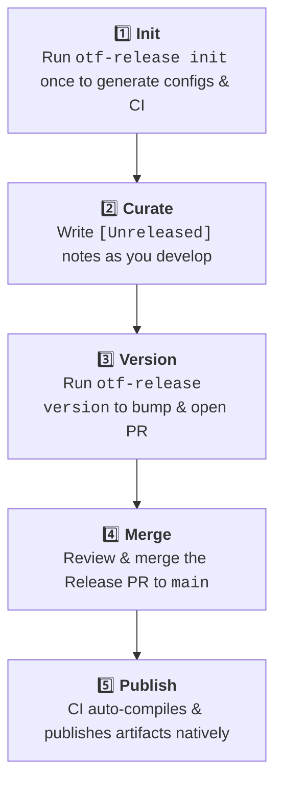

<div align="center">

# OTF Release

</div>

> Curated-changelog, manual-bump release CLI for polyglot monorepos.

A single-binary release tool for the OTF monorepo. You write the release notes
(in each package's `[Unreleased]` changelog section), you pick the bumps — `release`
handles the rest: dependency-aware version cascades, internal range upgrades, topological
publishing, and a matrix-gated GitHub release in one `release.yml`.

Unlike commit-driven tools, your hand-written `[Unreleased]` notes are the source of
truth — never inferred from commits. Unlike npm-locked tools, the publishing backend is
adapter-based: **npm, cargo, and a `generic` (bring-your-own-commands, e.g. JSR) today, others later**.

## Installation

You can easily install `otf-release` using our automated installation scripts:

**macOS / Linux:**
```bash
curl -fsSL https://raw.githubusercontent.com/Open-Tech-Foundation/release/main/install.sh | bash
```

**Windows (PowerShell):**
```powershell
irm https://raw.githubusercontent.com/Open-Tech-Foundation/release/main/install.ps1 | iex
```

Alternatively, you can compile from source using Cargo:
```bash
cargo install --git https://github.com/Open-Tech-Foundation/release
```

## Commands

| Command | Usage | Description |
|---------|-------|-------------|
| **`init`** | `otf-release init` | Interactive setup: configure ecosystems, build matrices, and artifacts. Generates `release.toml` and `release.yml`. |
| **`version`** | `otf-release version` | Interactive local release: choose bumps, cascade dependencies, write changelogs, and automatically open a Release PR. |
| **`publish`** | `otf-release publish` | Non-interactive CI flow: publishes changed packages in topological order, attaching staged build artifacts. |
| **`upgrade`** | `otf-release upgrade` | Upgrades your local `release.toml` and regenerates your CI pipeline to match the latest CLI version features. |

## Workflow



## License

MIT License. See [LICENSE](LICENSE) for details.


