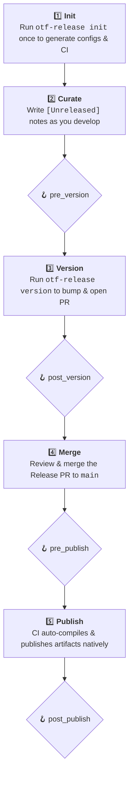

<div align="center">

# OTF Release

</div>

<div align="right">

Part of Open Tech Foundation ecosystem.

</div>

> Curated-changelog, manual-bump release CLI for polyglot monorepos.

A single-binary release tool for polyglot monorepos. You write your release notes in each package's `[Unreleased]` changelog section and pick the bumps — `otf-release` handles the rest: dependency-aware version cascades, topological publishing across multiple ecosystems (**npm, cargo, generic/JSR**), and a matrix-gated cross-platform GitHub release via a single generated `release.yml`. 

Unlike commit-driven tools, your hand-written notes are the strict source of truth.

## Installation

You can easily install `otf-release` using our automated installation scripts:

**macOS / Linux:**
```bash
curl -fsSL https://raw.githubusercontent.com/Open-Tech-Foundation/release/main/install.sh | bash
```

**Windows (PowerShell):**
```powershell
irm https://raw.githubusercontent.com/Open-Tech-Foundation/release/main/install.ps1 | iex
```

Alternatively, you can compile from source using Cargo:
```bash
cargo install --git https://github.com/Open-Tech-Foundation/release
```

## Commands

| Command | Usage | Description |
|---------|-------|-------------|
| **`init`** | `otf-release init` | Interactive setup: configure ecosystems, build matrices, and artifacts. Generates `release.toml` and `release.yml`. |
| **`version`** | `otf-release version` | Interactive local release: choose bumps, cascade dependencies, write changelogs, and automatically open a Release PR. |
| **`publish`** | `otf-release publish` | Non-interactive CI flow: publishes changed packages in topological order, attaching staged build artifacts. |
| **`config`** | `otf-release config` | Interactively edit your `release.toml` file without manually typing out OS architecture strings or workflow targets. |
| **`snapshot`** | `otf-release snapshot` | Non-interactive CI flow: completely automates an ephemeral snapshot release powered by a short git hash (e.g. `1.0.0-snapshot.a1b2c3d`) |
| **`self-update`** | `otf-release self-update` | Updates your local `otf-release` binary to the latest version published on GitHub Releases. |
| **`upgrade`** | `otf-release upgrade` | Upgrades your local `release.toml` and regenerates your CI pipeline to match the latest CLI version features. |

## Workflow



## Pre-releases

When running `otf-release version`, the interactive prompt will first ask you to select a release channel. By default, it uses the **stable** channel. If you select an alternative channel (e.g. `alpha`, `beta`, `rc`), `otf-release` will automatically compute valid semantic pre-release versions for your bumps.

For example, choosing a `minor` bump on the `beta` channel will transition `1.0.0` into `1.1.0-beta.0`. Once on a pre-release channel, you can select the new `prerelease` bump option to iterate tags (e.g., `beta.0` → `beta.1`).

## Snapshot Releases

To avoid polluting your changelog with every single CI run, you can configure an automated `snapshot` workflow. During `otf-release init`, the wizard will ask you for a snapshot tag (like `snapshot`, `canary`, or `edge`). 

This will automatically scaffold a `.github/workflows/snapshot.yml` that triggers on `main` branch pushes. It runs `otf-release snapshot`, which generates short-hash ephemeral versions (like `1.0.0-canary.a1b2c3d`) and automatically bumps your ecosystem boundaries and pushes to registries without touching your tags or PRs.

## Git Hosting Providers

During `otf-release init`, you will be prompted to select your Git hosting provider. This determines the format of the Release PRs, release links, and CI workflows generated by the CLI. 

Currently, **GitHub** is fully supported as the default provider. Support for GitLab, Bitbucket, Gitea, and Codeberg is planned and will be available in future releases. Your selection is saved as the `provider` field in `release.toml`.

## Lifecycle Hooks

You can define custom shell scripts to run at critical stages of the release process by editing your `release.toml` file. These hooks are executed across all operating systems automatically using your native shell (`sh` on Unix, `powershell` on Windows).

```toml
[hooks]
# Runs before the interactive version prompt starts (e.g. to validate repo state)
pre_version = ["npm run lint", "node scripts/validate.js"]

# Runs after versions and changelogs are updated, but BEFORE they are committed
post_version = ["python3 scripts/sync-docs.py"]

# Runs in CI before the publish loop begins
pre_publish = ["npm run test"]

# Runs in CI after everything is successfully published
post_publish = ["curl -X POST ..."]
```

## License

MIT License. See [LICENSE](LICENSE) for details.
