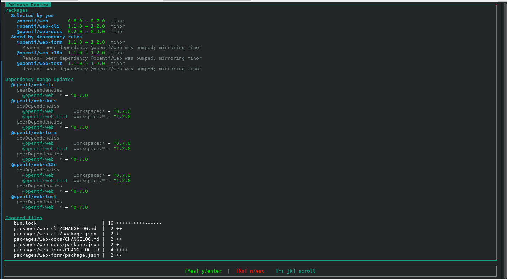
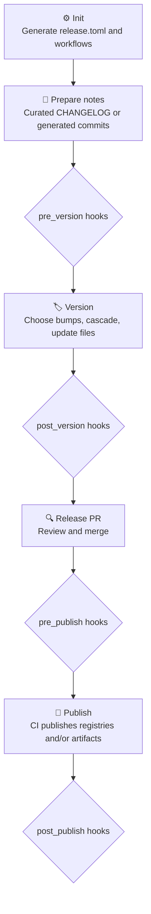

<h1 align="center">OTF Release</h1>

> Manual-bump, changelog-aware release CLI — single projects and monorepos, including polyglot setups.

<p align="center">
  
</p>

`otf-release` is a single Rust binary that helps a repo move from curated release notes to a
release PR, then to CI-driven publishing.

> **Core rule**
>
> Humans choose what to release and how much to bump. The tool handles dependency cascades,
> manifest edits, changelog updates, tags, publishing order, and generated release workflows.

## Contents

- [Quick start](#-quick-start)
- [Documentation](#-documentation)
- [Commands](#-commands)
- [Configuration](#-configuration)
- [Adapters](#-adapters)
- [Capabilities](#-capabilities)
- [Known gaps](#-known-gaps)
- [Release flow](#-release-flow)
- [Doc index](#-doc-index)

## 🚀 Quick start

### 1. Install

**macOS / Linux**

```bash
curl -fsSL https://raw.githubusercontent.com/Open-Tech-Foundation/release/main/install.sh | bash
```

**Windows PowerShell**

```powershell
irm https://raw.githubusercontent.com/Open-Tech-Foundation/release/main/install.ps1 | iex
```

**From source**

```bash
cargo install --git https://github.com/Open-Tech-Foundation/release
```

Already installed? Update with `otf-release self-update`.

### 2. Set up the repo

```bash
otf-release init   # writes release.toml and .github/workflows/release.yml
```

### 3. Cut a release

Prepare release notes (curated `CHANGELOG.md` `[Unreleased]`, or let `version` generate them), then:

```bash
otf-release version   # interactive bumps, cascades, changelog, opens the release PR
```

**Useful flag**

```bash
otf-release version --dry-run   # preview the plan; no file edits, commits, or PR
```

Curated changelog mode requires non-empty `[Unreleased]` notes in the configured scope: root
[`CHANGELOG.md`](CHANGELOG.md) for root mode, or each package's `CHANGELOG.md` for package-level
mode. See [changelog format](docs/changelog-format.md).

### 4. Publish

Merge the release PR — CI runs `check` → `build` → `publish`.

## 📚 Documentation

Full reference lives in [`docs/`](docs/README.md). Use these paths by role:

| I want to… | Start here |
| --- | --- |
| Understand the design | [Architecture](docs/architecture.md) |
| Set up a new repo | [init](docs/commands/init.md) → [configuration](docs/configuration.md) → [CI workflow](docs/ci-workflow.md) |
| Cut a release locally | [version](docs/commands/version.md) |
| Publish from CI | [publish](docs/commands/publish.md) · [preflight](docs/preflight.md) |
| Tune `release.toml` | [configuration](docs/configuration.md) · [config command](docs/commands/config.md) |
| Cross-compile binaries in CI | [matrix / build](docs/commands/matrix-build.md) |
| Gate releases in CI | [check](docs/commands/check.md) |
| Write or debug an adapter | [Adapter overview](docs/adapters/overview.md) |
| See what's planned | [Roadmap](docs/roadmap.md) |

## 🧭 Commands

Commands are grouped by where they run. Each links to reference docs where available.

### Setup & configuration

| Command | | What it does |
| --- | --- | --- |
| [`init`](docs/commands/init.md) | `supported` | Interactive setup. Writes [`release.toml`](docs/configuration.md) and `.github/workflows/release.yml`. |
| [`config`](docs/commands/config.md) | `supported` | Interactive editor for hooks, ecosystems, package build fields, generic package fields, provider, snapshot tag, changelog scope/strategy, and GitHub Release notes. |
| [`upgrade`](docs/commands/config.md) | `partial` | Regenerates `release.yml` from the current `release.toml`. Use `--force` to overwrite. |

### Local release

| Command | | What it does |
| --- | --- | --- |
| [`version`](docs/commands/version.md) | `supported` | Interactive local release flow. Choose bumps, cascade dependents, update manifests and changelogs, open the release PR. Flag: `--dry-run`. |

### CI pipeline

| Command | | What it does |
| --- | --- | --- |
| [`check`](docs/commands/check.md) | `supported` | Prints `true` when any configured package has a real version whose tag doesn't exist yet, else `false`. Drives the workflow `check-release` job so ordinary pushes to `main` skip the build. |
| [`matrix`](docs/commands/matrix-build.md) | `supported` | Prints the GitHub Actions build matrix (JSON) for a matrix package from `release.toml` — no hand-maintained target list in YAML. |
| [`build`](docs/commands/matrix-build.md) | `supported` | Builds one matrix target (`--package` / `--target`), cross-compiling as needed, and stages the binary at `bin/<platform>-<arch>/<bin>[.br]` for publish. |
| [`publish`](docs/commands/publish.md) | `supported` | Publishes in dependency order, skips already-published versions, creates `name@version` tags, and creates package releases from notes. Refuses to publish a matrix package whose per-platform binaries weren't staged. |
| [`snapshot`](docs/roadmap.md) | `experimental` | Creates hash-based prerelease versions such as `1.2.3-snapshot.a1b2c3d` and publishes them from CI. |

### Maintenance

| Command | | What it does |
| --- | --- | --- |
| [`self-update`](docs/README.md) | `supported` | Checks GitHub Releases and reruns the install script when a newer CLI version exists. |

## ⚙️ Configuration

Everything the tool knows about your repo lives in **`release.toml`** — written by `init`, edited
by hand or via `config`, and read by `version`, `publish`, and the generated workflow.

| Topic | Doc |
| --- | --- |
| Full schema (`adapters`, `tag_format`, `[[package]]`, hooks, …) | [configuration.md](docs/configuration.md) |
| Generated `release.yml` jobs and secrets | [ci-workflow.md](docs/ci-workflow.md) |
| Changelog layout and rewrite rules | [changelog-format.md](docs/changelog-format.md) |
| Pre-publish compliance checks | [preflight.md](docs/preflight.md) |

There is **no `--adapter` flag** — enabled ecosystems and per-package build steps are declared in
`release.toml`.

## 🧩 Adapters

Adapters own ecosystem-specific manifest reads, range syntax, cascade rules, registry checks, and
publish commands. The core never reads a `package.json` or `Cargo.toml` directly.

| Adapter | | Reference | Notes |
| --- | --- | --- | --- |
| **npm** | `supported` | [npm.md](docs/adapters/npm.md) | Discovers npm workspaces, preserves dependency range operators, resolves `workspace:*`, checks `npm view`, publishes with `npm publish --access public --no-workspaces`. |
| **Cargo** | `supported` | [cargo.md](docs/adapters/cargo.md) | Discovers Cargo workspaces, supports concrete crate versions and `version.workspace = true`, updates path dependency versions, checks `cargo info`, publishes with `cargo publish -p`. |
| **Generic** | `supported` | [generic.md](docs/adapters/generic.md) | Versions configured JSON/TOML/text manifest fields; optional publish command for registries such as JSR. Idempotency is tag-based. |

Implementing a new adapter? Start at [adapters/overview.md](docs/adapters/overview.md).

## ✅ Capabilities

### Versioning & dependencies

| Capability | Details |
| --- | --- |
| Polyglot versioning | [`version`](docs/commands/version.md) runs as one release transaction across all enabled adapters. |
| Dependency cascades | Adapter-owned rules. npm peer dependencies mirror the dependency bump; normal deps patch dependents. Cargo/generic dependents patch. |
| Private packages & apps | Never versioned or published; internal ranges are still updated so apps remain buildable. |
| Prereleases | Stable bumps, channel entry (`alpha`, `beta`, `rc`), channel iteration, channel switching, and graduation to stable. |

### Publishing & artifacts

| Capability | Details |
| --- | --- |
| Polyglot publishing | [`publish`](docs/commands/publish.md) loops enabled adapters and publishes each ecosystem in dependency order. |
| Build-only packages | CI builds artifacts and attaches them to a GitHub Release instead of publishing to a registry. |
| Matrix binaries | Cross-compiled per-target builds via [`matrix`](docs/commands/matrix-build.md) / [`build`](docs/commands/matrix-build.md), staged for publish. |

### Changelog & workflow

| Capability | Details |
| --- | --- |
| Curated changelog mode | Root [`CHANGELOG.md`](CHANGELOG.md) or per-package changelogs — selected during `init`. |
| Generated changelog mode | Notes from git commits since the last package tag, prepended to the configured changelog. |
| Lifecycle hooks | `pre_version`, `post_version`, `pre_publish`, `post_publish` in `release.toml`. |
| GitHub workflow generation | `release.yml` generated from `release.toml`; intended as editable scaffolds. |

### Integrations

| Capability | Details |
| --- | --- |
| Git providers | **GitHub only** today. Config has a `provider` field; other forges are [future work](docs/roadmap.md). |

## ⚠️ Known gaps

> See [roadmap.md](docs/roadmap.md) for the full list and priorities.

- **`snapshot` is experimental** — multi-adapter semantics, generated notes, rollback expectations, and workflow polish still need hardening.
- **Only GitHub is implemented** — GitLab, Bitbucket, Gitea, and Codeberg are planned.
- **`upgrade` is partial** — regenerates `release.yml` but does not yet cover every post-`init` workflow customization story.

## 🔁 Release flow



## 📑 Doc index

<details>
<summary><strong>All reference pages</strong></summary>

<br>

**Commands**

| Doc | Covers |
| --- | --- |
| [init](docs/commands/init.md) | Interactive setup; writes `release.toml` and `release.yml`. |
| [version](docs/commands/version.md) | Interactive local release flow. |
| [publish](docs/commands/publish.md) | Non-interactive CI publish flow. |
| [check](docs/commands/check.md) | CI gate — should this push run the release pipeline? |
| [matrix / build](docs/commands/matrix-build.md) | Matrix JSON and per-target cross-compiled builds. |
| [config](docs/commands/config.md) | Interactive `release.toml` editor. |

**Configuration & CI**

| Doc | Covers |
| --- | --- |
| [configuration](docs/configuration.md) | `release.toml` schema — the committed source of truth. |
| [ci-workflow](docs/ci-workflow.md) | The single generated `release.yml` model. |
| [changelog-format](docs/changelog-format.md) | Keep a Changelog conventions and rewrite rules. |
| [preflight](docs/preflight.md) | Strict, all-or-nothing compliance gate before publish. |

**Adapters**

| Doc | Covers |
| --- | --- |
| [overview](docs/adapters/overview.md) | The `Adapter` trait and domain types. |
| [npm](docs/adapters/npm.md) | npm workspaces — discovery, cascades, publish. |
| [cargo](docs/adapters/cargo.md) | Cargo workspaces — versions, path deps, publish. |
| [generic](docs/adapters/generic.md) | Bring-your-own manifest fields and publish command (e.g. JSR). |

**Meta**

| Doc | Covers |
| --- | --- |
| [architecture](docs/architecture.md) | Crate layout, core/adapter seam, data flow. |
| [roadmap](docs/roadmap.md) | Known gaps and upcoming work. |

</details>

## 📄 License

MIT. See [LICENSE](LICENSE).

---

<p align="center">
⚡ Powered by <a href="https://opentechf.org">Open Tech Foundation</a>
</p>