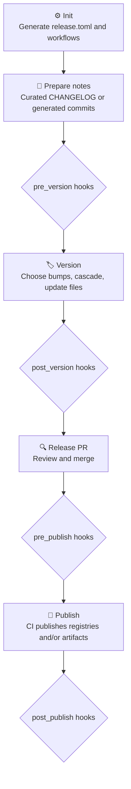

# OTF Release

> Manual-bump, changelog-aware release CLI for polyglot monorepos.

`otf-release` is a single Rust binary that helps a repo move from curated release notes to a
release PR, then to CI-driven publishing.

The core rule is simple: humans choose what to release and how much to bump; the tool handles
dependency cascades, manifest edits, changelog updates, tags, publishing order, and generated
GitHub workflows.

## ⚙️ Installation

**macOS / Linux**

```bash
curl -fsSL https://raw.githubusercontent.com/Open-Tech-Foundation/release/main/install.sh | bash
```

**Windows PowerShell**

```powershell
irm https://raw.githubusercontent.com/Open-Tech-Foundation/release/main/install.ps1 | iex
```

**From source**

```bash
cargo install --git https://github.com/Open-Tech-Foundation/release
```

## 🧭 Command Surface

| Command | Status | What it does |
| --- | --- | --- |
| `otf-release init` | ✅ Supported | Interactive setup. Writes `release.toml` and `.github/workflows/release.yml`. |
| `otf-release version` | ✅ Supported | Interactive local release flow. Use `--dry-run` to preview the plan without writing files, and `--first-release` when a package has no prior matching tag. |
| `otf-release publish` | ✅ Supported | CI-oriented publish flow. Publishes in dependency order, skips already-published versions, creates `name@version` tags, and creates package releases from notes. Refuses to publish a matrix package whose per-platform binaries weren't staged. |
| `otf-release check` | ✅ Supported | CI gate. Prints `true` when any configured package has a real version whose tag doesn't exist yet, else `false` — drives the workflow's `check-release` job so a non-release push to `main` skips the build. |
| `otf-release matrix` | ✅ Supported | CI helper. Prints the GitHub Actions build matrix (JSON) for a matrix package from `release.toml`, so `release.yml` never carries a hand-maintained target list. |
| `otf-release build` | ✅ Supported | CI helper. Builds one matrix target (`--package`/`--target`), cross-compiling as needed, and stages the binary at `bin/<platform>-<arch>/<bin>[.br]` for publish. |
| `otf-release snapshot` | 🧪 Experimental | Creates hash-based prerelease versions such as `1.2.3-snapshot.a1b2c3d` and publishes them from CI. |
| `otf-release config` | ✅ Supported | Interactive editor for hooks, ecosystems, package build fields, generic package fields, provider, snapshot tag, changelog scope/strategy, and GitHub Release notes. |
| `otf-release upgrade` | ◐ Partial | Regenerates `release.yml` from the current `release.toml`. |
| `otf-release self-update` | ✅ Supported | Checks GitHub Releases and reruns the install script when a newer CLI version exists. |

## Common Local Commands

Preview a release plan without editing files, committing, pushing, or opening a PR:

```bash
otf-release version --dry-run
```

Allow the first release of a publishable package that has no previous tag matching
`release.toml`'s `tag_format`:

```bash
otf-release version --first-release
```

Curated changelog mode requires non-empty `[Unreleased]` notes in the configured changelog scope:
root `CHANGELOG.md` for root mode, or each package's `CHANGELOG.md` for package-level mode.

## 🧩 Supported Adapters

| Adapter | Status | Notes |
| --- | --- | --- |
| npm | ✅ Supported | Discovers npm workspaces, preserves dependency range operators, resolves `workspace:*`, checks `npm view`, and publishes with `npm publish --access public --no-workspaces`. |
| Cargo | ✅ Supported | Discovers Cargo workspaces, supports concrete crate versions and `version.workspace = true`, updates path dependency versions, checks `cargo info`, and publishes with `cargo publish -p`. |
| Generic | ✅ Supported | Versions configured JSON/TOML/text manifest fields and optionally runs a configured publish command for registries such as JSR. Idempotency is tag-based. |

## ✅ Feature Matrix

| Area | Supported now | Notes |
| --- | --- | --- |
| Polyglot versioning | ✅ | `version` runs as one release transaction across all enabled adapters. |
| Polyglot publishing | ✅ | `publish` loops enabled adapters and publishes each ecosystem in dependency order. |
| Dependency cascades | ✅ | Adapter-owned rules. npm peer dependencies mirror the dependency bump; normal deps patch dependents. Cargo/generic dependents patch. |
| Private packages/apps | ✅ | Never versioned or published; internal ranges are still updated so apps remain buildable. |
| Curated changelog mode | ✅ | Uses either root `CHANGELOG.md` or package-level changelogs, selected during `init`. |
| Generated changelog mode | ✅ | Builds notes from git commit messages since the last package tag and prepends generated notes to the configured changelog. |
| Prereleases | ✅ | Supports stable bumps, channel entry (`alpha`, `beta`, `rc`), channel iteration, channel switching, and graduation to stable. |
| Build-only packages | ✅ | CI can build artifacts and attach them to a GitHub Release instead of publishing to a registry. |
| Lifecycle hooks | ✅ | `pre_version`, `post_version`, `pre_publish`, and `post_publish` run from `release.toml`. |
| GitHub workflow generation | ✅ | Generates release workflows from `release.toml`; intended as editable scaffolds. |
| Git providers | GitHub only | Config has a `provider` field, but only GitHub PR/release behavior is implemented. |

## ⚠️ Known Gaps

| Gap | Impact |
| --- | --- |
| `snapshot` is experimental. | Multi-adapter semantics, generated notes, rollback expectations, and workflow polish need more hardening. |
| Only GitHub is implemented. | GitLab, Bitbucket, Gitea, and Codeberg are future work. |

## 🔁 Release Flow



## 📄 License

MIT. See [LICENSE](LICENSE).

---

<p align="center">
Powered by <a href="https://opentechf.org">Open Tech Foundation</a>
</p>
